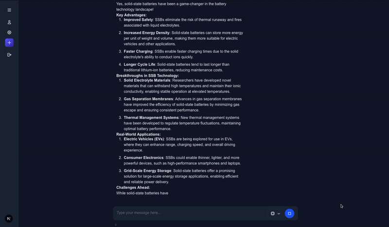

# AI Chatbot Platform with Docker and PostgreSQL

A modern web application that allows you to converse with multiple open-weight AI models (LLaMA 3, Gemma 3, Tinyllama, ...) or add them directly from ollama repo while seamlessly switching between them during conversations. Built with containerized AI models, PostgreSQL database, and a responsive web interface in NextJS 15. Self hosted and do not require API keys or subscriptions.

  

<div align="center">
    
</div>

## Features

- **Multiple AI Models**: Switch between open-weight models during conversations
- **Real-time Streaming**: Watch responses generate in real-time
- **User Management**: Secure authentication with email validation
- **Conversation History**: Store and retrieve past conversations
- **Dockerized**: Each AI model runs in isolated containers
- **Modern UI**: Clean, responsive interface with conversation sidebar
- **Production Ready**: Separate development and production environments

## Quick Start

### Prerequisites
- [Node.js](https://nodejs.org/) (version specified in `.nvmrc`)
- [Docker Desktop](https://www.docker.com/products/docker-desktop)
- [npm](https://www.npmjs.com/) or [yarn](https://yarnpkg.com/)

### Installation & Setup

1. **Clone and Install Dependencies**
First things first

 ```bash
nvm use
npm install
```

2. **AI set up**
Then, open Docker Desktop and run the containers :

Navigate to the folder ai-setup :
```bash
cd app/backend/ai-setup
```
<details open>
<summary>Run and deploy llama3-2 model (3 billion params)</summary>

```bash
docker compose -f compose.llama-3.yaml up
```
</details>
<details>
<summary>Run and deploy gemma-3 model (1 billion params)</summary>

```bash
docker compose -f compose.gemma-3.yaml up
```
</details>

> [!NOTE]
> Other models coming soon !

3. **Start up the database (postgres)**
Run the Postgres database on docker container :

```bash
cd app/backend/database/test
docker-compose --env-file ../../../../.env -f compose.test.yml up
```

> [!IMPORTANT]
> For production environment, it is important to use the "production" folder.

```bash
cd app/backend/database/prod
docker-compose --env-file ../../../../.env -f compose.prod.yml up
```

4. **Start up the interface**
Finally, run the development server in terminal:

```bash
npm run dev
# or
yarn dev
# or
pnpm dev
# or
bun dev
```

Open [http://localhost:3000](http://localhost:3000).

## Project Status

### ✅ Completed Features
**Web Interface**:
- [x] Create web interface

**Multiple Chatbots and real time streaming**:
- [x] First hard-coded message to chatbot (tinyllama)
- [x] Custom messages to chatbot using inputs
- [x] Allowing stream (message displaying while chatbot sends back the answer)
- [x] Update interface to look more like a modern conversation interface
- [x] Adding 2 other chatbots in separate containers
- [x] Making the new chatbots communicate with the app
- [x] Create a feature to choose the model on the interface
- [x] Add docker-compose file to project that gives the image of the 3 containers and run them

**Database Layer**:
- [x] Run a DB on Docker to store conversations 
- [x] Add storing layer

**User Authentication**:
- [x] Add identifying layer to identify user and store conversation on his account
- [x] Add signup page
- [x] Email validation

**Conversation Management**:
- [x] Finish function "create conversation"
- [x] Create feature (sidebar) to choose the conversation on the interface

**Finish UI details**:
- [x] Update interface (general UI : headers, conversation section, selection button, etc.)
- [x] Add function abort message
- [x] Create page "forgot password"
- [x] Add delete account
- [x] Add user settings to the UI and DB

### 🔧 In Progress / Upcoming
- [ ] Error handling
- [ ] Handle logs using promtail and loki (grafana)
- [ ] Implement backup solution for data
- [ ] More AI model integrations